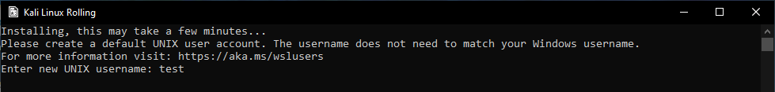
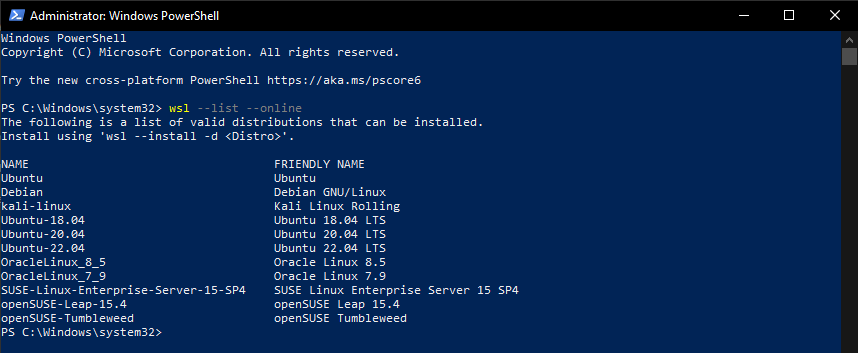
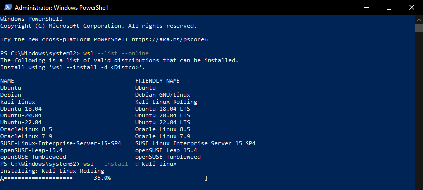
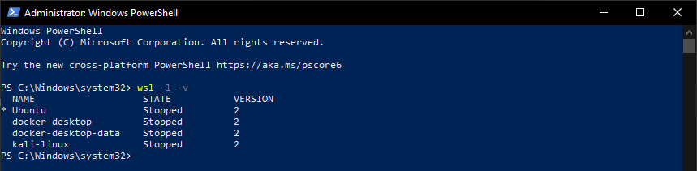

# Setup Windows Subsystem for Linux (WSL)

# Table of Contents
* [Overview](#overview)
* [Installation Guide](#install-wsl-on-windows)
    * [Requirements](#prerequisites)
    * [Install](#install-wsl)
    * [Optional: Select Linux Distribution](#optional-select-specific-linux-distribution-for-installation)
* [WSL Environment Setup](#wsl-environment-setup)
    * [Set up WSL Username and Password](#set-wsl-username-and-password)
    * [Recover Password](#wsl-password-recovery)
    * [Change Password](#change-wsl-password)
    * [Update WSL](#update-and-upgrade-wsl)
* [Manage WSL Distributions](#manage-wsl-distributions)
    * [List Installed WSL Distributions and their Versions](#list-all-installed-wsl-distributions-and-their-versions)
    * [Switch to Another WSL Distribution](#switch-to-another-wsl-distribution)

---

## **Overview**

**Windows Subsystem for Linux (WSL)**  is a feature in Windows 10 and above that allows users to run a GNU/Linux environment - including Linux command-line tools, utilities, and applications - natively on Windows. 

WSL allows users to use Linux-based software and tools on their Windows device without having to dual-boot a Linux **operating system (OS)** or use a **virtual machine (VM)**.

### **Benefits of WSL**

WSL offers multiple benefits to users including:

* **Compatibility**: Many software developers and system administrators use Linux-based tools and software, and WSL allows them to work with those tools directly on their Windows devices.

* **Ease of use**: With WSL, you don't need to set up a separate Linux environment, and you don't have to worry about compatibility issues between Windows and Linux.

* **Speed**: WSL is faster than using a virtual machine or dual-booting, because it runs directly on the Windows kernel.

### **Common Use Cases**

Some common use cases for WSL include:

* **Software development**: If you're a software developer, you may need to use Linux-based tools like Bash, Git, and Python, and WSL allows you to do so on your Windows device.

* **System administration**: If you work with servers or cloud-based infrastructure, you may need to use Linux-based command-line tools to manage your systems, and WSL can help you do that on your Windows device.

* **Education**: If you're learning Linux, WSL can provide you with a way to practice Linux commands and tools without having to set up a separate Linux environment.

---

## **Install WSL on Windows**


## **Prerequisites**

#### **Operating System**

WSL requires Windows 10 version 2004 and higher or Windows 11.

#### **Command-line Interface (CLI)**

To install WSL, you will need to use a **command-line interface (CLI)**. A CLI is a user interface that allows users to interact with a computer program or operating system through text commands entered into a command-line interface, rather than through a **graphical user interface (GUI)**.

Two CLIs are available by default to Windows Users:

1. ***Command Prompt***

Command Prompt (also known as cmd.exe) is the default command-line interface for Windows and is installed by default on Windows devices.
It provides a basic set of commands that can be used to perform tasks such as navigating the file system, running programs, and managing files and folders. 

2. ***PowerShell***

PowerShell is a is a powerful and feature-rich command-line interface for Windows that provides a more modern and robust scripting environment compared to Command Prompt, particularly for advanced users and system administrators who need to perform complex tasks and automate tasks.


## **Install WSL** 

> NOTE: The following guide uses PowerShell.


* Open Command Prompt or PowerShell in administrator mode by selecting the "Run as Administrator" option.


|**Run as Administrator**
|:--:|
||

* In PowerShell or Command Prompt, enter the following command:

```
wsl --install
```
|**Install WSL**
|:--:|
||

> NOTE: `wsl --install` runs properly when WSL is not installed on the device.  If WSL help text appears after running the command, then WSL may already be installed on the device.

* Windows will install WSL using the default Ubuntu distribution.

---

## WSL Environment Setup

### Set WSL Username and Password

The first step in WSL is setting a username and password for the distribution.

> NOTE: Each Linux distribution is assigned its own separate username and password. This username and password is unrelated to any Windows user credentials.  
> NOTE: The following examples use the Kali Linux WSL distribution.

After installation is complete, open WSL using the start menu:


| **WSL on the Start Menu** |
|:--:|
||

* Enter a username and password as prompted by WSL:

| **Enter New Username and Password** |
|:--:|
||

> NOTE: When entering a password in a Unix environment, the text does not appear on the screen as you type it. This is a security feature designed to prevent others from seeing the password as it is entered. 

> NOTE: After entering a username, the username will populate on the window of the terminal; for example `test@<user device>`.


| **Installation Complete*** |
|:--:|
| |

### Change WSL Password

To change the password for a WSL distribution enter the command `passwd` in the root directory of the WSL distribution. WSL will ask for the current password, and then ask the user to enter and confirm the new password.

### WSL Password Recovery

To recover a password for a WSL distribution do the following:

* Open Powershell
* Access the root directory of the default WSL distribution by entering the command `wsl -u root`.
    * To recover a password in another, non-default distribution, enter the command `wsl -d <target distribution> -u root` and replace `<target distribution>` with the name of the distribution.

For example:  

    wsl -d kali-linux -u root

### Update and Upgrade WSL

Linux distributions managed using WSL are not automatically updated or upgraded by Windows.  To upgrade any Linux distributions in WSL, open WSL and enter: `sudo apt update && sudo apt upgrade`. 

## Additional Tips and Information

WSL pairs well with Windows Terminal.

### Optional: Select Specific Linux Distribution for Installation

* The default Linux distribution installed for WSL is Ubuntu, but other Linux distributions are available for installation. To see a list of available Linux distributions enter:

```
wsl --list --online
```
|**List Linux Distributions Available for Installation**
|:--:|
||


#### Change WSL Distribution during Install

* To change the distribution during installation, enter the command `wsl --install` and include the `-d` (or `--distribution` ) flag, followed by the name of the distribution:

```
wsl --install -d < insert Distribution Name >
```

For example, to install [Kali Linux](https://en.wikipedia.org/wiki/Kali_Linux) - a Linux distribution used for digital forensics and penetration testing - enter the following command:

```
wsl --install -d kali-linux
```

|**Example: Install Kali Linux**
|:--:|
||


---

## Manage WSL Distributions

### List All Installed WSL Distributions and their Versions

To see a list of all the WSL distributions and their version numbers use the `-l` and `-v` flags to enter the following command:

```
wsl -l -v
```

| **List Installed Distributions**
|:--:|
||


> NOTE: The `-l` option (or `--list`) lists all the installed WSL distributions and their default status (marked with an asterisk).

> The `-v` option (or `--verbose`) adds more information to the list, including the distribution version and running status.

> The `*` next to Ubuntu in this example signifies that Ubuntu is the current default distribution for WSL.

### Set Default WSL Distribution

To switch between WSL distributions, first set the default distribution:

* Note the names of the two distributions you want to switch between.
* Enter the following command with the name of the distribution you want to be the default:

```
wsl --set-default <distribution name>
```

* Close Command Prompt or PowerShell.
* Open a new Command Prompt or PowerShell window.
* Relaunch WSL using the `wsl` command to launch into the new default WSL distribution.

| **Switch Default Distibution** |
|:--:|
|  |
| 

### Switch to Another WSL Distribution

To switch to another WSL distribution enter the following command:

```
wsl -d <distribution name>
```


---
